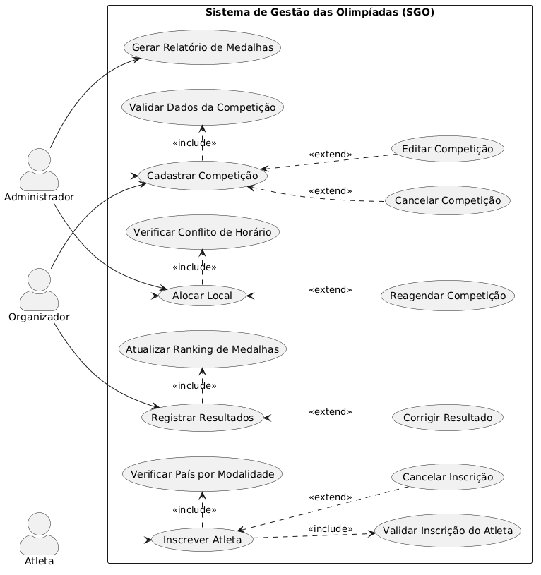
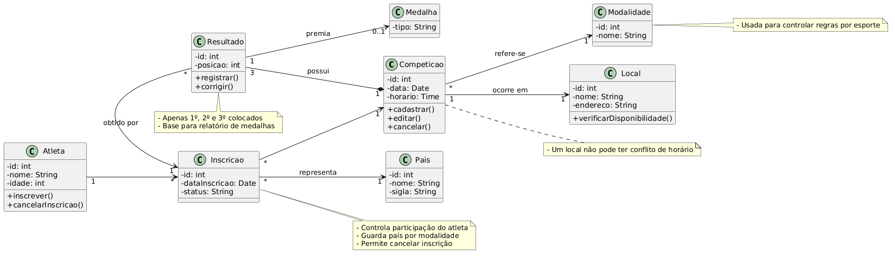
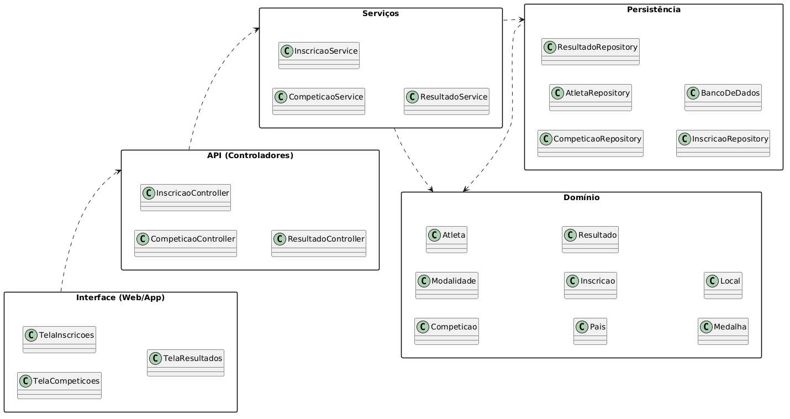
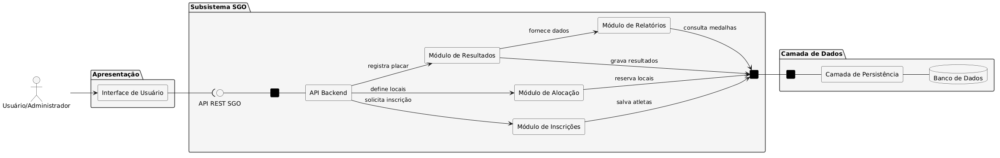
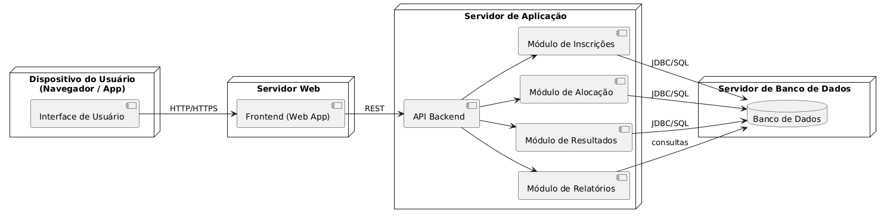

# Sistema de Gestão das Olimpíadas (SGO)

Este projeto apresenta a modelagem UML para o Sistema de Gestão das Olimpíadas, cobrindo desde o gerenciamento de competições até o controle de medalhas.

## 📝 Histórias de Usuário

### Gerenciamento de Competições
- **US01:** Como Administrador, eu quero cadastrar novas competições (modalidade, data, hora e local), para que o calendário olímpico seja estabelecido.
- **US02:** Como Administrador, eu quero listar todas as competições cadastradas, para manter o controle da organização do evento.

### Inscrição de Atletas
- **US03:** Como Atleta, eu quero me inscrever em uma modalidade específica representando meu país, para que eu possa competir oficialmente.
- **US04:** Como Administrador, eu quero validar se um atleta está representando apenas um país por modalidade, para garantir o cumprimento das regras olímpicas.

### Alocação e Infraestrutura
- **US05:** Como Administrador, eu quero alocar um local específico para uma prova, para garantir que a infraestrutura esteja preparada.
- **US06:** Como Administrador, eu quero que o sistema me impeça de alocar um local já ocupado no mesmo horário, para evitar conflitos de agenda.

### Resultados e Classificação
- **US07:** Como Juiz/Administrador, eu quero registrar o placar final e os vencedores (1º, 2º e 3º lugares) de uma competição, para oficializar os resultados.
- **US08:** Como Atleta, eu quero visualizar os resultados das competições em que participei, para acompanhar meu desempenho.

### Relatórios e Ranking
- **US09:** Como Comitê Olímpico, eu quero gerar um relatório de medalhas por país (ouro, prata e bronze), para visualizar o ranking geral das Olimpíadas.
- **US10:** Como Usuário do sistema, eu quero filtrar o quadro de medalhas por país ou modalidade, para encontrar informações específicas rapidamente.

---

## 📊 Diagramas (Imagens)

 ### Diagrama de Casos de Uso

### Diagrama de Classes

### Diagrama de Pacotes

### Diagrama de Coponentes

### Diagrama de Implantação

 

---

## 💻 Códigos Fonte (PlantUML)

Você pode acessar os códigos-fonte originais nos links abaixo:

* [📄 Código: Caso de Uso](Plantuml/Casos-de-uso.puml)
* [📄 Código: Classes](Plantuml/Classes.puml)
* [📄 Código: Pacotes](Plantuml/Pacotes.puml)
* [📄 Código: Componentes](Plantuml/Componentes.puml)
* [📄 Código: Implantação](Plantuml/Implementação.puml)
